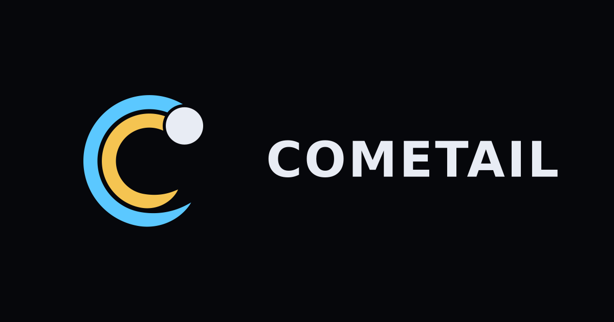
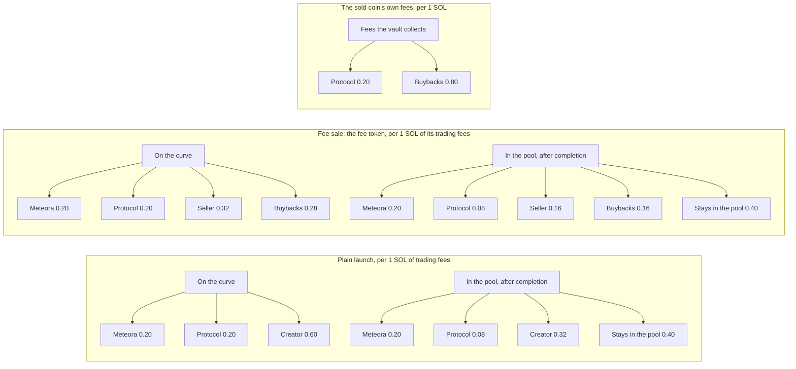
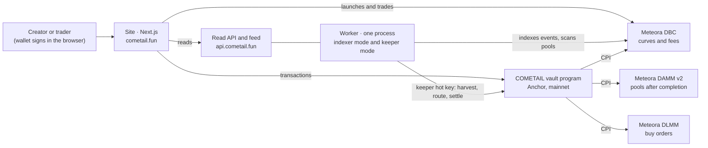

<p align="center">
  <a href="https://cometail.fun"></a>
</p>

<p align="center"><b>A token launchpad on Meteora where a creator can sell a coin's future trading fees for SOL today.</b><br>
<i>Launch a comet. Sell the tail.</i></p>

<p align="center">
  
  
  
  
  
  <a href="https://cometail.fun"></a>
  <a href="https://x.com/cometailfun"></a>
</p>

<p align="center">Live on Solana mainnet since October 4, 2026 · <a href="https://cometail.fun">cometail.fun</a> · <a href="https://cometail.fun/sell">sell your fees</a> · <a href="https://cometail.fun/launch">launch a token</a> · <a href="https://cometail.fun/sky">explore tokens</a></p>

<!-- Demo video: link goes here after the launch. -->

## What it does

- **Launch a token.** Six fixed price curves on Meteora's Dynamic Bonding Curve (DBC), 0.01 SOL to launch. Every trade pays a 1% fee: 60% of it is yours while the coin is on its curve, 32% once it trades in its pool. When the curve completes, the liquidity moves to a DAMM v2 pool and locks for good (80% in your position, 20% in the protocol's).
- **Sell your fees.** A coin that still earns fees can turn its future fees into SOL now. Its creator fee rights (or a permanently locked DAMM v2 position) go into a vault, and the vault launches a *fee token* on its own curve. When that curve completes you receive your chosen share of the raise (25%, 50% or 75%) in SOL. From then on the coin's fees buy the fee token back and burn it. If the curve has not completed thirty days after launch, you can unwind and take your fee rights back.
- **For buyers of a fee token.** Holding it gives no claim on the fees. The fees fund standing buy orders on a DLMM pair below the market price, and whatever those orders buy is burned. Finite orders, no guaranteed floor; every disclosure is on the vault page.

## How it works

### Where each 1 SOL of fees goes

Gross figures per stage, as the program constants and `docs/economics.md` define them and as the site states them.



At completion of a fee token's curve the seller is paid the chosen share of the raise (25%, 50% or 75%); the rest becomes permanently locked liquidity, 80% in the vault's position and 20% in the protocol's.

### A vault's life

States and instruction names are the program's (`programs/cometail_vault/src/state.rs`, `lib.rs`).

```mermaid
stateDiagram-v2
    [*] --> Open: create_vault
    Open --> Open: deposit_dbc_rights / deposit_position / withdraw_stream
    Open --> Launched: launch (the fee token starts on a stream config)
    Launched --> Live: register_own_position (the fee token's curve completed and migrated; cashout paid the seller)
    Launched --> Unwound: unwind (thirty days after launch, curve still below its target)
    Live --> Live: harvest, route, settle (collect fees, place buy orders, burn fills)
    Unwound --> [*]: withdraw_stream returns every fee source
```



### Architecture



The program custodies fee rights under a program-derived vault, launches the fee token with the vault as the pool's creator, harvests income through CPI, and turns that income into DLMM limit orders that burn what they fill. The keeper's hot key has bounded power: it chooses when to harvest and where to place orders, never a destination it controls. The admin wallet signs nothing in day-to-day operation. See `docs/security.md`.

### $COMETAIL buyback and burn

Half of the protocol's revenue buys $COMETAIL on its pool and burns it, on chain, through a separate program
(`programs/cometail_burn`). The launch configs created for it name the program as fee claimer: anyone can
trigger the claim, and the program splits every claim 50/50 between its burn reserve and the protocol treasury.
For today's configs and the tails' share, the owner sends half to the reserve. A buyback spends a bounded chunk
at most every ten minutes and burns everything it bought in the same instruction. The site shows the total
burned and every burn with its signature. Design, bounds and limits: `docs/burn.md`.

### Tails

A tail is a coin, $tX, launched on COMETAIL and pointed at an existing coin $X. The first is $tCOMETAIL, pointed
at $COMETAIL. $X stays exactly as it is: nobody deposits or sells $X's fees and nothing is taken from it.

The owner launches a tail from the owner's own wallet on the Take 50% fee-sale config: no vault, no deposit, and
no program of ours involved. When the owner claims the tail's creator fees on `/admin/tails`, the same transaction
splits them: half stays in the wallet, a quarter goes to the burn reserve (which can only buy $COMETAIL and burn
it), and a quarter becomes $COMETAIL liquidity in a position the wallet holds, permanently locked by DAMM v2 in
that transaction. **The split is done by us, by hand, in the open; no code forces it.** The tail's page lists
every claim of the tail's creator fees with its transaction, found through the creator wallet's own transactions,
including any claim that was not split: the SOL sent to the burn, the $COMETAIL the buybacks that spent that SOL
bought and burned (traced first in, first out through the reserve, shown only when the reserve's ledger proves it)
and the liquidity locked. At graduation, 50% of the raise goes to the creator wallet
(DBC's creator migration fee) and the rest is locked in the tail's own pool; after graduation, the creator
position's fees are claimed through the burn program's owner claim, which sends half to the reserve by itself.
How it fits together: `docs/architecture.md` (Tails); the numbers: `docs/economics.md`.

## On mainnet

Program deployed and protocol initialized on October 4, 2026. The upgrade authority is the admin wallet. The deployed bytes are the reviewed release (`docs/deploy.md`). Every address below is from `configs/mainnet.json`.

| What | Address |
|---|---|
| Vault program | [`5xmZWYheruQjHQChg5YVtXjZUNmVKzvjJ6FYArtf4tmg`](https://solscan.io/account/5xmZWYheruQjHQChg5YVtXjZUNmVKzvjJ6FYArtf4tmg) |
| Protocol account | [`3FrYZjy6uax82FqWVASL8GUQNM1DnRJ7UZU18cZbLHFR`](https://solscan.io/account/3FrYZjy6uax82FqWVASL8GUQNM1DnRJ7UZU18cZbLHFR) |
| Admin wallet (upgrade authority, protocol admin) | [`CXcbg8xiVmiUNCymi1EmUCq49g11NZbUb4JSE5z2KJU9`](https://solscan.io/account/CXcbg8xiVmiUNCymi1EmUCq49g11NZbUb4JSE5z2KJU9) |
| Launch treasury (fee claimer of the six launch presets) | [`3zKVjACVhRYooppC3r7iyEcQTENao3kAnn5UZ656x8qL`](https://solscan.io/account/3zKVjACVhRYooppC3r7iyEcQTENao3kAnn5UZ656x8qL) |
| Protocol treasury (admin's WSOL account) | [`3BVodzoL6GUMAmQT1pEGBGRcDKLZhXa3hKdEdY5aZUxD`](https://solscan.io/account/3BVodzoL6GUMAmQT1pEGBGRcDKLZhXa3hKdEdY5aZUxD) |
| Keeper | [`Hic1yuYP4jJvLnFeNDDcqsYtu3T4rJm99STgBqp4K2z7`](https://solscan.io/account/Hic1yuYP4jJvLnFeNDDcqsYtu3T4rJm99STgBqp4K2z7) |
| Config: Standard (plain; coins before 2026-10-07) | [`GQWJhBpSMdLfhLvGV8CyiPMfRceBmuddQGcoa3jsJrNr`](https://solscan.io/account/GQWJhBpSMdLfhLvGV8CyiPMfRceBmuddQGcoa3jsJrNr) |
| Config: Long curve | [`CNVrEew9HsMAMzhJf7PjcZ6XgQZtx5CK4JdH3rCNYd2f`](https://solscan.io/account/CNVrEew9HsMAMzhJf7PjcZ6XgQZtx5CK4JdH3rCNYd2f) |
| Config: Flat curve | [`25rrasLtmySk1G5Vju5h1N57N69NVyZ3oRMBYoTDwPB6`](https://solscan.io/account/25rrasLtmySk1G5Vju5h1N57N69NVyZ3oRMBYoTDwPB6) |
| Config: Exponential | [`BA5oWqu8REqRhrHtL1Y49inzH2rq6qijbt2qs38maYdQ`](https://solscan.io/account/BA5oWqu8REqRhrHtL1Y49inzH2rq6qijbt2qs38maYdQ) |
| Config: Dollar-paired (USDC) | [`9DJNdWVULyT2qdi98vCwQP4g6aXSSxgLYCwaqpQoro33`](https://solscan.io/account/9DJNdWVULyT2qdi98vCwQP4g6aXSSxgLYCwaqpQoro33) |
| Config: Stock-paired (NVDAx) | [`9L3jTPZUwMURUx4Y3dGNed7MuGKvwu3PAWy4rxx247Yf`](https://solscan.io/account/9L3jTPZUwMURUx4Y3dGNed7MuGKvwu3PAWy4rxx247Yf) |
| Config: fee sale, take 25% | [`3Q7S3itpN2rrmWWgiEmQgKmoopbCbMQZ6AZNv3dKjjTk`](https://solscan.io/account/3Q7S3itpN2rrmWWgiEmQgKmoopbCbMQZ6AZNv3dKjjTk) |
| Config: fee sale, take 50% | [`6THaSTuvF3o45DVLPW5DtvwcLjdtW6Nt3MFGR4kUdD3L`](https://solscan.io/account/6THaSTuvF3o45DVLPW5DtvwcLjdtW6Nt3MFGR4kUdD3L) |
| Config: fee sale, take 75% | [`D1qr993WEU5aL7ZM4WXs9oKSBaUkzaxmHDTqTy4fr9na`](https://solscan.io/account/D1qr993WEU5aL7ZM4WXs9oKSBaUkzaxmHDTqTy4fr9na) |
| Burn program ($COMETAIL buyback and burn; upgrade authority: admin wallet) | [`BuN6MuTRCD7VuzwRpvJKPFwh86bsU81L23tKtRBofhX1`](https://solscan.io/account/BuN6MuTRCD7VuzwRpvJKPFwh86bsU81L23tKtRBofhX1) · [verified build](https://verify.osec.io/status/BuN6MuTRCD7VuzwRpvJKPFwh86bsU81L23tKtRBofhX1) |
| Burn claimer (fee claimer of the four burn configs) | [`FsA7AFz9xNE72zpGA5XSHPuXe7e4EwDx7wHZxABTVp3U`](https://solscan.io/account/FsA7AFz9xNE72zpGA5XSHPuXe7e4EwDx7wHZxABTVp3U) |
| Burn reserve | [`79DaKJLNKKyKGJHAsjHTwK4ygjt9Xfv2gdeZq1LH5ojM`](https://solscan.io/account/79DaKJLNKKyKGJHAsjHTwK4ygjt9Xfv2gdeZq1LH5ojM) |
| Launch configs since 2026-10-07 (fees split 50/50 by the burn program): Standard, Long, Flat, Exponential | [`CRvUbHQV…`](https://solscan.io/account/CRvUbHQVzNSQV5wKanxzba1NYYP1AcZCF6RLT56yJGxf) · [`Bv2qDDbY…`](https://solscan.io/account/Bv2qDDbYk52FhXxsmrxnNTEnmnhx84RJsu3ZAU5RSJKJ) · [`4LWPPcTc…`](https://solscan.io/account/4LWPPcTcu6CaZriCrn2o13P9jPo4VGDxstkKLsKF6Mk8) · [`F2DmGKBW…`](https://solscan.io/account/F2DmGKBWQ1PyH7ZxjK4X2uxtPAgbMvzMYvzAm5fK7efA) |
| Quote mints | USDC [`EPjFWdd5AufqSSqeM2qN1xzybapC8G4wEGGkZwyTDt1v`](https://solscan.io/account/EPjFWdd5AufqSSqeM2qN1xzybapC8G4wEGGkZwyTDt1v) · NVDAx [`Xsc9qvGR1efVDFGLrVsmkzv3qi45LTBjeUKSPmx9qEh`](https://solscan.io/account/Xsc9qvGR1efVDFGLrVsmkzv3qi45LTBjeUKSPmx9qEh) |

## Presets

Every preset is a Meteora DBC config owned by the protocol: its curve, fees and completion point cannot change. Parameters are the full-size files in `configs/`, as `web/src/content/presets.ts` presents them.

| Launch preset | Quote | Market cap, start to completion | Raise to complete | Fee claimer |
|---|---|---|---|---|
| Standard | SOL | 20 to 120 SOL | 34.788 SOL | launch treasury |
| Long curve | SOL | 20 to 360 SOL, sixteen segments | 122.709 SOL | launch treasury |
| Flat curve | SOL | 60 to 120 SOL, sixteen segments | 47.601 SOL | launch treasury |
| Exponential | SOL | 20 to 240 SOL, sixteen segments | 30.675 SOL | launch treasury |
| Dollar-paired | USDC | 2,000 to 12,000 USDC | 3,478.78 USDC | launch treasury |
| Stock-paired | NVDAx | 2 to 16 stock units, sixteen segments | 5.667 units | launch treasury |

Common to the six: a 1% trade fee with 60% to the creator on the curve, 0.01 SOL to launch, a fixed supply of 1,000,000,000, liquidity locked for good at completion.

| Fee-sale config | Seller receives at completion | Raise to complete | Locked liquidity (before Meteora's 0.2% migration fee) | Fee claimer |
|---|---|---|---|---|
| Take 25% | 9.376 SOL (25%) | 37.506 SOL | 28.129 SOL | admin |
| Take 50% | 20.343 SOL (50%) | 40.685 SOL | 20.343 SOL | admin |
| Take 75% | 33.340 SOL (75%) | 44.453 SOL | 11.113 SOL | admin |

Fee-sale configs charge no creation fee. Locked liquidity splits 80% to the vault's position and 20% to the protocol's.

### Fee splits, per 1 SOL of each line

| Line | Meteora | Protocol | Creator or seller | Buybacks | Stays in the pool |
|---|---|---|---|---|---|
| Plain launch, on the curve | 0.20 | 0.20 | 0.60 | | |
| Plain launch, in the pool | 0.20 | 0.08 | 0.32 | | 0.40 |
| Fee token, on the curve | 0.20 | 0.20 | 0.32 | 0.28 | |
| Fee token, in the pool | 0.20 | 0.08 | 0.16 | 0.16 | 0.40 |
| The sold coin's fees | taken upstream | 0.20 | 0 | 0.80 | |
| DLMM fees earned by the buy orders | per DLMM | 0 | 0 | all | |

The three vault-internal ratios are program constants (`programs/cometail_vault/src/constants.rs`): seller 8/15 of the vault's share of curve fees, 1/2 of its pool position fees, protocol 1/5 of deposited income. The protocol's partner shares are claimed through DBC and DAMM v2 directly and never pass through the vault program.

## For builders

### Repository layout

| Path | What it is |
|---|---|
| `programs/cometail_vault` | The on-chain program (Anchor). Custodies fee rights under a program-derived vault, launches the fee token, harvests through CPI, places DLMM buy orders, burns fills, unwinds. |
| `programs/cometail_burn` | The burn program: claims the new launch configs' protocol fees, splits them 50/50 (burn reserve, treasury), buys back $COMETAIL in bounded chunks and burns it. |
| `packages/client` | `@cometail/client`: PDAs, instruction builders and account decoders for the program. Used by the site, the worker and the tests. |
| `packages/sdk` | `@cometail/sdk`: typed read clients for the public API and a resumable event feed. No wallet, never signs. |
| `web` | The site (Next.js 15). Every line of copy lives in `web/src/content/cometail.ts`. |
| `worker` | The keeper and the indexer: one process, three modes (keeper, indexer, once). Serves the read API. |
| `configs` | The nine DBC config files and the deployed addresses (`mainnet.json`, `devnet.json`). |
| `tests` | The LiteSVM harness against the real Meteora programs, the regression suite, the release gates, the devnet and mainnet scripts. |
| `idls` | Pinned Meteora IDLs. |
| `deploy` | Service units, reverse-proxy config and the worker environment example. |
| `docs` | Architecture, economics, security, release gates, deploy and hosting, the API, the runbooks. |

### Running it locally

```
pnpm install
pnpm build:program                                  # anchor build --arch v0
pnpm --filter @cometail/tests build:forwarder       # the test suite does not build it
pnpm test:program                                   # one process per test file
pnpm dev:web                                        # copy web/.env.local.example to web/.env.local first
```

Toolchain used: Node 22.12 or newer, pnpm 12.8, Rust 1.99, Solana CLI 3.1.10, Anchor CLI 1.2.0. The program is built in the sBPF v0 format (`--arch v0`): Anchor 1.2 defaults to v3, which the LiteSVM release in the harness cannot load. The release build and its hash are in `docs/deploy.md`.

### Read API and SDK

The read API at `https://api.cometail.fun` is GET-only JSON: tokens, trades, vaults, events, the pool map, prices, metrics, and a WebSocket feed with a resumable cursor. Routes and the envelope are in `docs/api.md`. From TypeScript:

```ts
import { CometailClient } from "@cometail/sdk";
const api = new CometailClient({ baseUrl: "https://api.cometail.fun" });
```

`packages/sdk/README.md` has the rest. Anyone can create pools on the six launch configs with Meteora's DBC SDK: the fee split is applied by the DBC program on every swap, no agreement needed (`docs/presets.md`).

### Docs

- [`docs/architecture.md`](docs/architecture.md): how a vault works end to end.
- [`docs/economics.md`](docs/economics.md): every fee split with numbers.
- [`docs/security.md`](docs/security.md): the authority model, the keys and what each can do.
- [`docs/burn.md`](docs/burn.md): the $COMETAIL buyback and burn: what is enforced, the bounds, the accounting, the cutover.
- [`docs/release-gates.md`](docs/release-gates.md): the tests that must pass before a release.
- [`docs/deploy.md`](docs/deploy.md): the size build and the deployment record.
- [`docs/worker.md`](docs/worker.md): the keeper and the indexer, configuration and behaviour.
- [`docs/hosting.md`](docs/hosting.md): services and the reverse proxy.
- [`docs/api.md`](docs/api.md): the read API and the feed.
- [`docs/presets.md`](docs/presets.md): the launch presets, for any launchpad.
- [`docs/mainnet-runbook.md`](docs/mainnet-runbook.md): the ordered mainnet procedure.
- [`docs/devnet-checklist.md`](docs/devnet-checklist.md): the browser pass on devnet.

Built on Meteora: DBC for the curves, DAMM v2 for the pools after completion, DLMM for the buy orders. All three are load-bearing.
