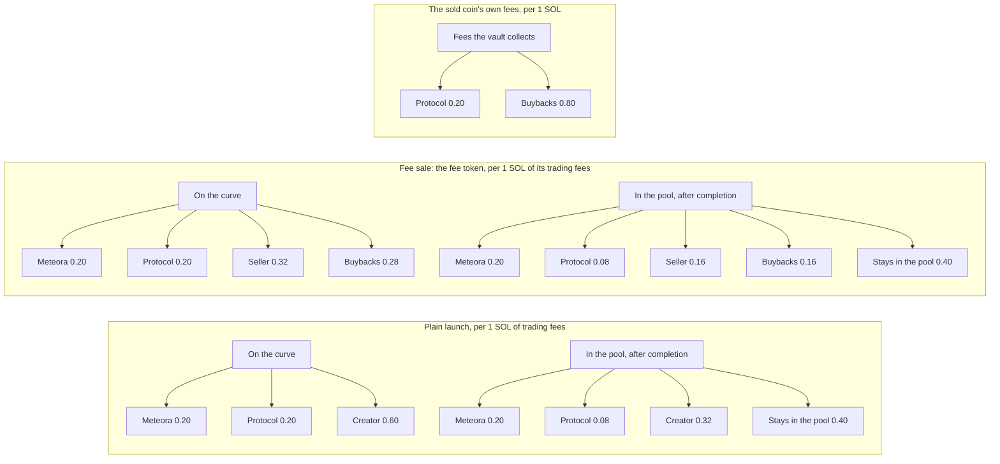
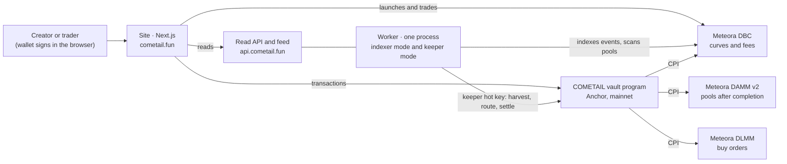

<p align="center">
  <a href="https://cometail.fun"></a>
</p>

<p align="center"><b>A fee layer for Meteora. Every Dynamic Bonding Curve coin earns fees on every trade; COMETAIL makes those fees visible, puts them to work and lets a creator sell them.</b><br>
<i>Launch a comet. Sell the tail.</i></p>

<p align="center">
  <a href="https://github.com/thegrootdev/cometail/actions/workflows/ci.yml"></a>
  
  
  <a href="https://verify.osec.io/status/5xmZWYheruQjHQChg5YVtXjZUNmVKzvjJ6FYArtf4tmg"></a>
  <a href="https://verify.osec.io/status/BuN6MuTRCD7VuzwRpvJKPFwh86bsU81L23tKtRBofhX1"></a>
  <a href="LICENSE"></a>
  <a href="https://x.com/cometailfun"></a>
</p>

<p align="center">Live on Solana mainnet since October 4, 2026 · <a href="https://cometail.fun">cometail.fun</a> · <a href="https://cometail.fun/stats">the numbers, with sources</a> · <a href="https://cometail.fun/fees">Fee Index</a> · <a href="https://cometail.fun/launch">launch a coin</a> · <a href="https://cometail.fun/sell">sell your fees</a></p>

<!-- Demo video: link goes here. -->

## Why

Meteora's Dynamic Bonding Curve (DBC) runs hundreds of thousands of launches, and every one of them pays a fee on every trade. Those fees are hard to see (they sit in each pool until someone claims them), they mostly do nothing once claimed, and a creator who wants SOL today cannot sell next month's fees. In Q1 2026 only 1.4% of DBC curves graduated ([Pine Analytics](https://pineanalytics.substack.com/p/meteora-q1-2026-quarterly-report)), so for most coins the fees are the only lasting value they produce. COMETAIL treats those fees as the asset.

## What is live

- **Fee Index** ([`/fees`](https://cometail.fun/fees)). Every DBC pool on mainnet, from every launchpad, read from chain: what each coin's creator has earned, what is claimable right now (exact), and which launchpads pay their creators most. 427,797 pools on 224,900 configs, refreshed every five minutes.
- **A launchpad whose fees work** ([`/launch`](https://cometail.fun/launch)). Seven launch presets on DBC for 0.01 SOL, one of them paired with $COMETAIL (below). Coins graduate into DAMM v2 pools in compounding fee mode with the liquidity permanently locked. On the launch configs since October 7 the protocol's share of every fee is claimed through the burn program, which sends half of it to a reserve that can only buy $COMETAIL and burn it.
- **$COMETAIL buyback and burn** (`programs/cometail_burn`, verified build). Claims fees through program-derived claimer configs, splits them 50/50 on chain, buys $COMETAIL in bounded chunks at most every ten minutes and burns all of it in the same instruction.
- **Tails** ([`/tails`](https://cometail.fun/tails)). Coins we launched from our own wallet. A creator fee claim made on our tails page splits in its own transaction: half kept, a quarter to the burn reserve, a quarter added to $COMETAIL's pool as permanently locked liquidity. No code forces the split; the indexer lists every claim, split or not, and a claim that was not split can be made up once, later, in a transaction that names it.
- **Fee sales** ([`/sell`](https://cometail.fun/sell), `programs/cometail_vault`, verified build). A creator moves a coin's DBC fee rights, or a locked DAMM v2 position, into a program vault; the vault launches a *fee token* on its own curve and pays the seller 25%, 50% or 75% of the raise when that curve completes. On mainnet today one vault is launched and harvesting (2.00 SOL of fees collected so far); its fee token has not graduated yet. After graduation the vault's fees fund DLMM limit orders below the market and burn what they fill. That DLMM step is tested against Meteora's mainnet binaries (LiteSVM gates) and on devnet, and fires on mainnet when the first fee token graduates. Holding a fee token gives no claim on the fees: the buy orders are finite and there is no price floor (every disclosure is on the vault page).
- **Proof** ([`/stats`](https://cometail.fun/stats)). Every figure below, live, each with the time it was read and a link to check it; a public read API and a TypeScript SDK.

## The numbers

Read on 2026-10-09 at 14:35 UTC; live and linked at [cometail.fun/stats](https://cometail.fun/stats). SOL figures only; "us" means the team's own wallets.

| Figure | Value | Source |
|---|---|---|
| Coins launched on our configs | 12 (4 by us, 8 by others) | [`/api/tokens`](https://api.cometail.fun/api/tokens?sort=newest&limit=100) |
| Graduated to a Meteora pool | 2 ($COMETAIL and TAIL, both ours) | DBC pool accounts, `/api/stats` |
| Trading volume | 2,066.08 SOL over 4,038 trades by 869 wallets (201.94 SOL on coins launched by others) | every indexed swap on the curves and graduated pools ([`/api/stats`](https://api.cometail.fun/api/stats)); $COMETAIL's 24 h volume matched DexScreener within 0.5% |
| Trading fees recorded by the pools | 20.45 SOL, of which 3.85 SOL paid to Meteora's protocol (referral payouts are not in these counters) | the pools' own counters on chain: DBC `totalTradingQuoteFee` / `totalProtocolQuoteFee`, DAMM v2 `totalLpBFee` (including the compounding share) / `totalProtocolBFee` |
| $COMETAIL burned | 4,828,868 in 25 buybacks, 0.663 SOL spent | the burn program's state account ([`/api/burn`](https://api.cometail.fun/api/burn)) |
| Liquidity permanently locked | $COMETAIL pool 99.98%, TAIL pool 99.99% | DAMM v2 `permanentLockLiquidity` / `liquidity` |
| Tail claims | 2: one split when claimed, one made up later; 0.2354 SOL claimed, 0.0588 SOL to the burn, 0.0292 SOL + 187,089 $COMETAIL locked | [`/api/tail-claims`](https://api.cometail.fun/api/tail-claims) |
| Fee-sale vaults | 1 launched, 2.00 SOL harvested, 1.448 SOL waiting for buybacks | vault accounts ([`/api/vaults`](https://api.cometail.fun/api/vaults)) |
| Fee Index coverage | 427,797 DBC pools, 224,900 configs, 4,025 creator claims confirmed | [`/api/fees/status`](https://api.cometail.fun/api/fees/status) |

## Verified programs

Both programs were rebuilt from this repository by OtterSec's public verifier; the result matches the bytes on mainnet.

| Program | Address | Verified build | Source |
|---|---|---|---|
| Vault (fee sales) | [`5xmZWYheruQjHQChg5YVtXjZUNmVKzvjJ6FYArtf4tmg`](https://solscan.io/account/5xmZWYheruQjHQChg5YVtXjZUNmVKzvjJ6FYArtf4tmg) | [verify.osec.io](https://verify.osec.io/status/5xmZWYheruQjHQChg5YVtXjZUNmVKzvjJ6FYArtf4tmg) | [`741e8e7`](https://github.com/thegrootdev/cometail/tree/741e8e751825b005b6cedc359a7e8c6d937997dd) |
| Burn ($COMETAIL buyback and burn) | [`BuN6MuTRCD7VuzwRpvJKPFwh86bsU81L23tKtRBofhX1`](https://solscan.io/account/BuN6MuTRCD7VuzwRpvJKPFwh86bsU81L23tKtRBofhX1) | [verify.osec.io](https://verify.osec.io/status/BuN6MuTRCD7VuzwRpvJKPFwh86bsU81L23tKtRBofhX1) | [`5895634`](https://github.com/thegrootdev/cometail/tree/58956342a8c9e65892ea4fcad2704b579959854b) |

## How it uses Meteora

| Meteora program | What COMETAIL calls | Where |
|---|---|---|
| DBC | `initialize_virtual_pool_with_spl_token`, `transfer_pool_creator`, `claim_creator_trading_fee`, `withdraw_migration_fee`, `creator_withdraw_surplus` (CPI from the vault program); `claim_trading_fee`, `claim_partner_pool_creation_fee`, `partner_withdraw_surplus` (CPI from the burn program); the migration crank and swap quotes (worker, site); thirteen protocol-owned configs | `programs/cometail_vault/src/instructions/{launch,streams,harvest}.rs`, `programs/cometail_burn/src/instructions/claims.rs`, `worker/src/bootstrap.ts`, `web/src/lib/dbc.ts` |
| DAMM v2 | `claim_position_fee`, `create_position`, `split_position`, `update_delegate_permission` (vault CPI); `swap` (burn buyback CPI); `add_liquidity` and `permanent_lock_position` (tail claims); compounding fee mode on every graduated pool | `programs/cometail_vault/src/instructions/{harvest,streams,deposit}.rs`, `programs/cometail_burn/src/instructions/buyback.rs`, `packages/client/src/tail.ts` |
| DLMM | `place_limit_order`, `cancel_limit_order`, `close_limit_order_if_empty` (vault CPI), with bin arrays and limit orders decoded on chain; pair and bin-array setup (keeper). Tested against Meteora's mainnet binaries and on devnet; runs on mainnet when a fee token graduates | `programs/cometail_vault/src/instructions/ladder.rs`, `worker/src/bootstrap.ts`, `tests/gates`, `tests/regression/dlmm.test.ts` |

The release gates run the programs against Meteora's own mainnet binaries in LiteSVM (`docs/release-gates.md`).

## How it works

### Where each 1 SOL of fees goes

Gross figures per stage, as the program constants and `docs/economics.md` define them and as the site states them.



At completion of a fee token's curve the seller is paid the chosen share of the raise (25%, 50% or 75%); the rest becomes permanently locked liquidity, 80% in the vault's position and 20% in the protocol's.

### A vault's life

States and instruction names are the program's (`programs/cometail_vault/src/state.rs`, `lib.rs`).

```mermaid
stateDiagram-v2
    [*] --> Open: create_vault
    Open --> Open: deposit_dbc_rights / deposit_position / withdraw_stream
    Open --> Launched: launch (the fee token starts on a stream config)
    Launched --> Launched: harvest (fees collect while the fee token's curve fills)
    Launched --> Live: register_own_position (the fee token's curve completed and migrated; cashout paid the seller)
    Launched --> Unwound: unwind (thirty days after launch, curve still below its target)
    Live --> Live: harvest, route, settle (collect fees, place buy orders, burn fills)
    Unwound --> [*]: withdraw_stream returns every fee source
```



### Architecture



The program custodies fee rights under a program-derived vault, launches the fee token with the vault as the pool's creator, harvests income through CPI, and turns that income into DLMM limit orders that burn what they fill. The keeper's hot key has bounded power: it chooses when to harvest and where to place orders, never a destination it controls. The admin wallet signs nothing in day-to-day operation. See `docs/security.md`.

### $COMETAIL buyback and burn

Half of the protocol's revenue buys $COMETAIL on its pool and burns it, on chain, through a separate program
(`programs/cometail_burn`). The launch configs created for it name the program as fee claimer: anyone can
trigger the claim, and the program splits every claim 50/50 between its burn reserve and the protocol treasury.
For the launch configs created before October 7 and for the tails' share, the owner sends half to the reserve. A buyback spends a bounded chunk
at most every ten minutes and burns everything it bought in the same instruction. The site shows the total
burned and every burn with its signature. Design, bounds and limits: `docs/burn.md`.

### Tails

A tail is a coin whose fees feed another coin. Ours are launched from the owner's wallet on the Take 50% config,
with no vault and no program of ours involved; the first is $tCOMETAIL, pointed at $COMETAIL. Each claim of a
tail's creator fees, made on `/admin/tails`, is split in the same transaction: half stays in the wallet, a quarter
goes to the burn reserve and a quarter becomes $COMETAIL liquidity, permanently locked by DAMM v2. **No code forces
the split; we do it in the open.** The indexer finds every claim through the wallet's own transactions, split or
not, and the tail's page shows each one with its transaction, what its quarter bought and burned, and the liquidity
it locked. Details: `docs/architecture.md` (Tails).

## On mainnet

Vault program deployed and protocol initialized on October 4, 2026; burn program live on October 7. The upgrade authority of both is the admin wallet, and both builds are verified (above). Every address below is from `configs/mainnet.json`.

| What | Address |
|---|---|
| Vault program | [`5xmZWYheruQjHQChg5YVtXjZUNmVKzvjJ6FYArtf4tmg`](https://solscan.io/account/5xmZWYheruQjHQChg5YVtXjZUNmVKzvjJ6FYArtf4tmg) |
| Protocol account | [`3FrYZjy6uax82FqWVASL8GUQNM1DnRJ7UZU18cZbLHFR`](https://solscan.io/account/3FrYZjy6uax82FqWVASL8GUQNM1DnRJ7UZU18cZbLHFR) |
| Admin wallet (upgrade authority, protocol admin) | [`CXcbg8xiVmiUNCymi1EmUCq49g11NZbUb4JSE5z2KJU9`](https://solscan.io/account/CXcbg8xiVmiUNCymi1EmUCq49g11NZbUb4JSE5z2KJU9) |
| Launch treasury (fee claimer of the six launch presets) | [`3zKVjACVhRYooppC3r7iyEcQTENao3kAnn5UZ656x8qL`](https://solscan.io/account/3zKVjACVhRYooppC3r7iyEcQTENao3kAnn5UZ656x8qL) |
| Protocol treasury (admin's WSOL account) | [`3BVodzoL6GUMAmQT1pEGBGRcDKLZhXa3hKdEdY5aZUxD`](https://solscan.io/account/3BVodzoL6GUMAmQT1pEGBGRcDKLZhXa3hKdEdY5aZUxD) |
| Keeper | [`Hic1yuYP4jJvLnFeNDDcqsYtu3T4rJm99STgBqp4K2z7`](https://solscan.io/account/Hic1yuYP4jJvLnFeNDDcqsYtu3T4rJm99STgBqp4K2z7) |
| Config: Standard (plain; coins before 2026-10-07) | [`GQWJhBpSMdLfhLvGV8CyiPMfRceBmuddQGcoa3jsJrNr`](https://solscan.io/account/GQWJhBpSMdLfhLvGV8CyiPMfRceBmuddQGcoa3jsJrNr) |
| Config: Long curve (coins before 2026-10-07) | [`CNVrEew9HsMAMzhJf7PjcZ6XgQZtx5CK4JdH3rCNYd2f`](https://solscan.io/account/CNVrEew9HsMAMzhJf7PjcZ6XgQZtx5CK4JdH3rCNYd2f) |
| Config: Flat curve (coins before 2026-10-07) | [`25rrasLtmySk1G5Vju5h1N57N69NVyZ3oRMBYoTDwPB6`](https://solscan.io/account/25rrasLtmySk1G5Vju5h1N57N69NVyZ3oRMBYoTDwPB6) |
| Config: Exponential (coins before 2026-10-07) | [`BA5oWqu8REqRhrHtL1Y49inzH2rq6qijbt2qs38maYdQ`](https://solscan.io/account/BA5oWqu8REqRhrHtL1Y49inzH2rq6qijbt2qs38maYdQ) |
| Config: Dollar-paired (USDC) | [`9DJNdWVULyT2qdi98vCwQP4g6aXSSxgLYCwaqpQoro33`](https://solscan.io/account/9DJNdWVULyT2qdi98vCwQP4g6aXSSxgLYCwaqpQoro33) |
| Config: Stock-paired (NVDAx) | [`9L3jTPZUwMURUx4Y3dGNed7MuGKvwu3PAWy4rxx247Yf`](https://solscan.io/account/9L3jTPZUwMURUx4Y3dGNed7MuGKvwu3PAWy4rxx247Yf) |
| Config: fee sale, take 25% | [`3Q7S3itpN2rrmWWgiEmQgKmoopbCbMQZ6AZNv3dKjjTk`](https://solscan.io/account/3Q7S3itpN2rrmWWgiEmQgKmoopbCbMQZ6AZNv3dKjjTk) |
| Config: fee sale, take 50% | [`6THaSTuvF3o45DVLPW5DtvwcLjdtW6Nt3MFGR4kUdD3L`](https://solscan.io/account/6THaSTuvF3o45DVLPW5DtvwcLjdtW6Nt3MFGR4kUdD3L) |
| Config: fee sale, take 75% | [`D1qr993WEU5aL7ZM4WXs9oKSBaUkzaxmHDTqTy4fr9na`](https://solscan.io/account/D1qr993WEU5aL7ZM4WXs9oKSBaUkzaxmHDTqTy4fr9na) |
| Burn program ($COMETAIL buyback and burn; upgrade authority: admin wallet) | [`BuN6MuTRCD7VuzwRpvJKPFwh86bsU81L23tKtRBofhX1`](https://solscan.io/account/BuN6MuTRCD7VuzwRpvJKPFwh86bsU81L23tKtRBofhX1) · [verified build](https://verify.osec.io/status/BuN6MuTRCD7VuzwRpvJKPFwh86bsU81L23tKtRBofhX1) |
| Burn claimer (fee claimer of the four burn configs) | [`FsA7AFz9xNE72zpGA5XSHPuXe7e4EwDx7wHZxABTVp3U`](https://solscan.io/account/FsA7AFz9xNE72zpGA5XSHPuXe7e4EwDx7wHZxABTVp3U) |
| Burn reserve | [`79DaKJLNKKyKGJHAsjHTwK4ygjt9Xfv2gdeZq1LH5ojM`](https://solscan.io/account/79DaKJLNKKyKGJHAsjHTwK4ygjt9Xfv2gdeZq1LH5ojM) |
| Launch configs since 2026-10-07 (fees split 50/50 by the burn program): Standard, Long, Flat, Exponential | [`CRvUbHQV…`](https://solscan.io/account/CRvUbHQVzNSQV5wKanxzba1NYYP1AcZCF6RLT56yJGxf) · [`Bv2qDDbY…`](https://solscan.io/account/Bv2qDDbYk52FhXxsmrxnNTEnmnhx84RJsu3ZAU5RSJKJ) · [`4LWPPcTc…`](https://solscan.io/account/4LWPPcTcu6CaZriCrn2o13P9jPo4VGDxstkKLsKF6Mk8) · [`F2DmGKBW…`](https://solscan.io/account/F2DmGKBWQ1PyH7ZxjK4X2uxtPAgbMvzMYvzAm5fK7efA) |
| Quote mints | USDC [`EPjFWdd5AufqSSqeM2qN1xzybapC8G4wEGGkZwyTDt1v`](https://solscan.io/account/EPjFWdd5AufqSSqeM2qN1xzybapC8G4wEGGkZwyTDt1v) · NVDAx [`Xsc9qvGR1efVDFGLrVsmkzv3qi45LTBjeUKSPmx9qEh`](https://solscan.io/account/Xsc9qvGR1efVDFGLrVsmkzv3qi45LTBjeUKSPmx9qEh) |

## Presets

Every preset is a Meteora DBC config owned by the protocol: its curve, fees and completion point cannot change. Parameters are the full-size files in `configs/`, as `web/src/content/presets.ts` presents them.

| Launch preset | Quote | Market cap, start to completion | Raise to complete | Fee claimer |
|---|---|---|---|---|
| Standard | SOL | 20 to 120 SOL | 34.788 SOL | launch treasury |
| Long curve | SOL | 20 to 360 SOL, sixteen segments | 122.709 SOL | launch treasury |
| Flat curve | SOL | 60 to 120 SOL, sixteen segments | 47.601 SOL | launch treasury |
| Exponential | SOL | 20 to 240 SOL, sixteen segments | 30.675 SOL | launch treasury |
| Dollar-paired | USDC | 2,000 to 12,000 USDC | 3,478.78 USDC | launch treasury |
| Stock-paired | NVDAx | 2 to 16 stock units, sixteen segments | 5.667 units | launch treasury |
| Paired with $COMETAIL | $COMETAIL | 75M to 450M $COMETAIL (about 10 to 61 SOL on 10 Oct 2026), one segment | 130.45M $COMETAIL | launch treasury |

Common to the seven: a 1% trade fee with 60% to the creator on the curve, 0.01 SOL to launch, a fixed supply of 1,000,000,000, liquidity locked for good at completion.

**Paired with $COMETAIL.** The coin's quote is $COMETAIL, so its raise, its fees and its graduated pool are in $COMETAIL. Buyers still pay with SOL: in one transaction the site buys exactly the $COMETAIL the trade needs on $COMETAIL's own pool, then buys the coin; a seller chooses SOL back or keeps the $COMETAIL. At graduation the raise becomes a coin/$COMETAIL pool whose liquidity is locked for good. The protocol's share arrives in $COMETAIL; each claim pays into a fresh account that burns exactly half and sends the other half to the treasury in the same transaction, so a claim that pays anything else fails. Prices are shown in SOL and dollars at $COMETAIL's pool price, so they also move with $COMETAIL. Details and limits: [`docs/presets.md`](docs/presets.md#paired-with-cometail).

| Fee-sale config | Seller receives at completion | Raise to complete | Locked liquidity (before Meteora's 0.2% migration fee) | Fee claimer |
|---|---|---|---|---|
| Take 25% | 9.376 SOL (25%) | 37.506 SOL | 28.129 SOL | admin |
| Take 50% | 20.343 SOL (50%) | 40.685 SOL | 20.343 SOL | admin |
| Take 75% | 33.340 SOL (75%) | 44.453 SOL | 11.113 SOL | admin |

Fee-sale configs charge no creation fee. Locked liquidity splits 80% to the vault's position and 20% to the protocol's.

### Fee splits, per 1 SOL of each line

| Line | Meteora | Protocol | Creator or seller | Buybacks | Stays in the pool |
|---|---|---|---|---|---|
| Plain launch, on the curve | 0.20 | 0.20 | 0.60 | | |
| Plain launch, in the pool | 0.20 | 0.08 | 0.32 | | 0.40 |
| Fee token, on the curve | 0.20 | 0.20 | 0.32 | 0.28 | |
| Fee token, in the pool | 0.20 | 0.08 | 0.16 | 0.16 | 0.40 |
| The sold coin's fees | taken upstream | 0.20 | 0 | 0.80 | |
| DLMM fees earned by the buy orders | per DLMM | 0 | 0 | all | |

The three vault-internal ratios are program constants (`programs/cometail_vault/src/constants.rs`): seller 8/15 of the vault's share of curve fees, 1/2 of its pool position fees, protocol 1/5 of deposited income. The protocol's partner shares are claimed through DBC and DAMM v2 directly and never pass through the vault program.

## For builders

### Repository layout

| Path | What it is |
|---|---|
| `programs/cometail_vault` | The on-chain program (Anchor). Custodies fee rights under a program-derived vault, launches the fee token, harvests through CPI, places DLMM buy orders, burns fills, unwinds. |
| `programs/cometail_burn` | The burn program: claims the new launch configs' protocol fees, splits them 50/50 (burn reserve, treasury), buys back $COMETAIL in bounded chunks and burns it. |
| `packages/client` | `@cometail/client`: PDAs, instruction builders and account decoders for the program. Used by the site, the worker and the tests. |
| `packages/sdk` | `@cometail/sdk`: typed read clients for the public API and a resumable event feed. No wallet, never signs. |
| `web` | The site (Next.js 15). Every line of copy lives in `web/src/content/cometail.ts`. |
| `worker` | The keeper and the indexer: one process, three modes (keeper, indexer, once). Serves the read API. |
| `configs` | The nine DBC config files and the deployed addresses (`mainnet.json`, `devnet.json`). |
| `tests` | The LiteSVM harness against the real Meteora programs, the regression suite, the release gates, the devnet and mainnet scripts. |
| `idls` | Pinned Meteora IDLs. |
| `deploy` | Service units, reverse-proxy config and the worker environment example. |
| `docs` | Architecture, economics, security, the burn, release gates, deploy and hosting, the API. |

### Running it locally

```
pnpm install
pnpm build:program                                  # anchor build --arch v0
pnpm --filter @cometail/tests build:forwarder       # the test suite does not build it
pnpm test:program                                   # one process per test file
pnpm dev:web                                        # copy web/.env.local.example to web/.env.local first
```

Toolchain used: Node 22.12 or newer, pnpm 12.8, Solana CLI 3.1.10 (platform tools v1.52, rustc 1.89 for the SBF build), Anchor CLI 1.2.0. The program is built in the sBPF v0 format (`--arch v0`): Anchor 1.2 defaults to v3, which the LiteSVM release in the harness cannot load. The release build and its hash are in `docs/deploy.md`.

### Read API and SDK

The read API at `https://api.cometail.fun` is GET-only JSON: tokens, trades, vaults, events, the pool map, prices, metrics, and a WebSocket feed with a resumable cursor. Routes and the envelope are in `docs/api.md`. From TypeScript:

```ts
import { CometailClient } from "@cometail/sdk";
const api = new CometailClient({ baseUrl: "https://api.cometail.fun" });
```

`packages/sdk/README.md` has the rest. Anyone can create pools on the six launch configs with Meteora's DBC SDK: the fee split is applied by the DBC program on every swap, no agreement needed (`docs/presets.md`).

### Docs

- [`docs/architecture.md`](docs/architecture.md): how a vault works end to end.
- [`docs/economics.md`](docs/economics.md): every fee split with numbers.
- [`docs/security.md`](docs/security.md): the authority model, the keys and what each can do.
- [`docs/burn.md`](docs/burn.md): the $COMETAIL buyback and burn: what is enforced, the bounds, the accounting, the cutover.
- [`docs/release-gates.md`](docs/release-gates.md): the tests that must pass before a release.
- [`docs/deploy.md`](docs/deploy.md): the size build and the deployment record.
- [`docs/worker.md`](docs/worker.md): the keeper and the indexer, configuration and behaviour.
- [`docs/hosting.md`](docs/hosting.md): services and the reverse proxy.
- [`docs/api.md`](docs/api.md): the read API and the feed.
- [`docs/presets.md`](docs/presets.md): the launch presets, for any launchpad.

Built on Meteora: DBC for the curves and fees, DAMM v2 for the locked pools after completion and the burn's buybacks, DLMM for the fee tokens' buy orders once they graduate.

MIT licensed (`LICENSE`).
